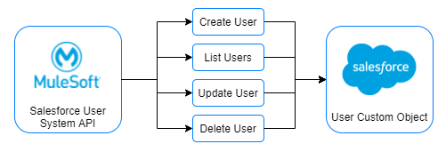
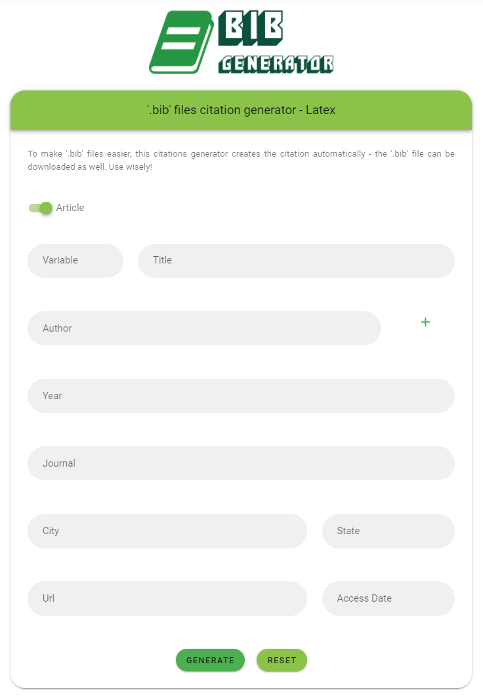
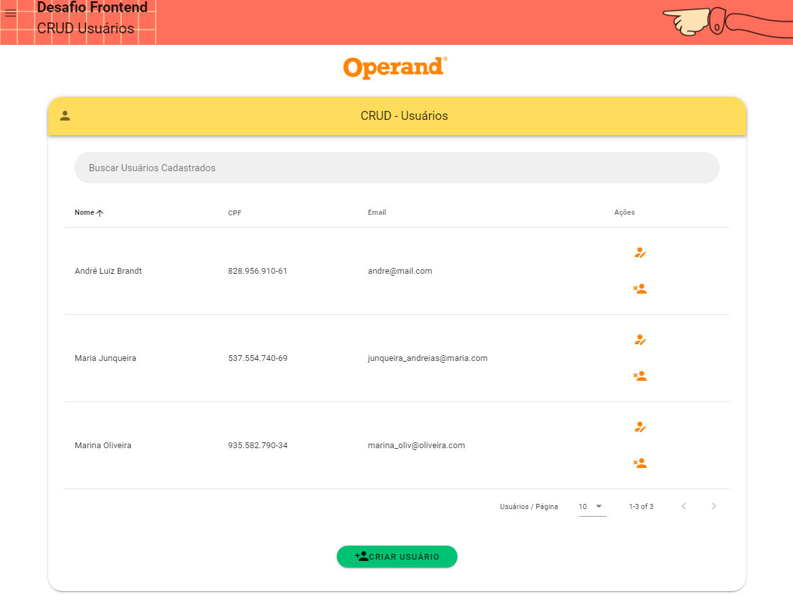

### Hi, I'm André Luiz! :)

## :mag: Who am I?

Hi! I'm a developer. Graduated on Computer Engineering on UNIFEI (Universidade Federal de Itajubá - Campus Itabira, MG, Brazil). Just a 25 year old guy trying to figure out things, always trying to code every single issue to turn it on solutions. Numbers, coffee, dogs and lines of code are my main passions.

 

## :bulb: Fields of Interest
- REST API Development
- Integration
- CRM
- Software Engineering
- Frontend Development
- Machine Learning
- IOT
- Data Science
- DevOps
- Servless and Microservices architechture

 

## :chart_with_upwards_trend: Goals for 2022
- Build REST APIs for data consumption
- Get my MCIA Mulesoft certification (Solutions Integration Architect)
- Get my AWS Solutions Architect certification

 

## :green_book: Languages, Frameworks and Technologies

 

 
 

 ## :gem: Top Langs 
 
 
	

 

 

## :wrench: Projects

### Salesforce - Mulesoft Custom User Object CRUD

  

This project contains a simple implementation of a REST API built on MuleSoft, which communicates with Salesforce. The API has the complete CRUD for a Custom Salesforce Object that represents users. Salesforce is a technology that provides customer relationship management (CRM) service and also provides a complementary suite of enterprise applications focused on customer service, marketing automation, analytics, and application development. MuleSoft is a technology that provides integration software for connecting applications, data and devices, designed to integrate software as a service (SaaS), on-premises software, legacy systems and other platforms. <a href="https://github.com/Luizbrandt/users-crud-salesforce">More info.</a>

#### Used Technologies
- <a href="https://www.salesforce.com/">Salesforce</a>
- <a href="https://www.mulesoft.com/">MuleSoft</a>

### Quotes Generator - 'bib' (Latex)

  

Latex quote's generator for '.bib' files and Overleaf projects. The user's inputs turn into a json-like variable that can be placed on a '/bib' file, or donwloaded as a '.bib' file. Click <a href="https://quote-generator-bib.web.app/">here</a> or in the logo above to go to the website. The following image shows the interface layout.

 

#### Used Technologies
- Vue.js (Vuetify)
- Node.Js (<a href="https://www.npmjs.com/package/file-saver">Node File Saver</a>)

### AFEMG Id Generator

  

ID generator for AFEMG (Associação Mineira de Famílias Educadoras). The administrator can regiester AFEMG's associates so they can use credentials to generate and print their ID. The ID contains two codes: public and private. The public one can be used on AFEMG's website to validate it's signature. The private one can be used with the user's CPF to generate a ID dynamically. Partner companies can use AFEMG's validation system to provide discounts and benefits to members and associates. Click <a href="https://afemg-clients.web.app/">here</a> or in the logo above to go to the website.

 

 

#### Used Technologies
- <a href="https://vuejs.org/">Vue</a>
- <a href="https://vuetifyjs.com/en/">Vuetify</a>
- <a href="https://nodejs.org/en/">Node</a>
- <a href="https://www.mongodb.com/">MongoDB</a>
- <a href="https://developer.mozilla.org/pt-BR/docs/Web/JavaScript">Javascript</a>

 

#### Collaborators
- <a href="https://github.com/Saviollage">Sávio Lage (Backend)</a>
 

### Users CRUD Api

Simple API that implements a User's CRUD using Node.Js and MongoDB. Created as a job application challenge - build an Vue.Js web.app that contemplate a User's CRUD (Create, Read, Update and Delete).
- <a href="https://users-simple-crud.herokuapp.com/">Heroku App</a>.
- <a href="https://github.com/Luizbrandt/user-crud-simple-api">GitHub Repository</a>.

#### Used Technologies
- MongoDB/Mongoose
- Express
- Node.Js
- Heroku App

### Users CRUD Frontend

User Interface (UI) built on Vue.js to consume the users crud simple API. The image below shows the main app's interface.

<strong>Information:</strong>
- <a href="https://operand-challenge.web.app/">WEB App</a>.
- <a href="https://github.com/Luizbrandt/vue-users-crud-frontend">GitHub Repository</a>.

#### Used Technologies
- Vue.Js (Vuetify, Router, Axios)
- Node.Js
- Firebase

## :trophy: Github Stats

  

 

## :phone: Wanna chat?
- <a href="https://linkedin.com/in/andré-luiz-brandt-engcomp">LinkedIn</a>.
- <a href="https://api.whatsapp.com/send?phone=+5524981642703">Whatsapp</a>.
- <a href="https://t.me/brandtluizandre">Telegram</a>.
- <a href="mailto:abrandtfrancisco@gmail.com">Mail me</a>.
