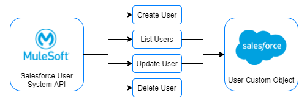
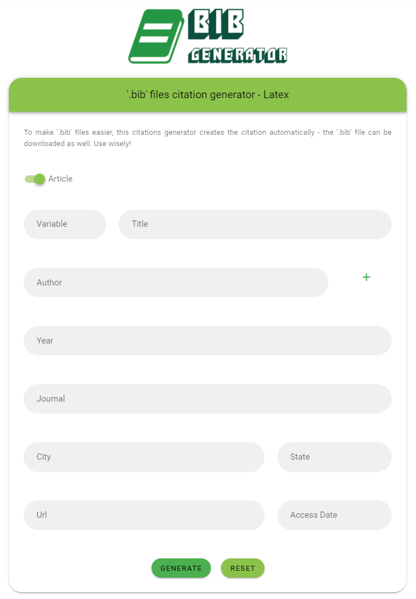
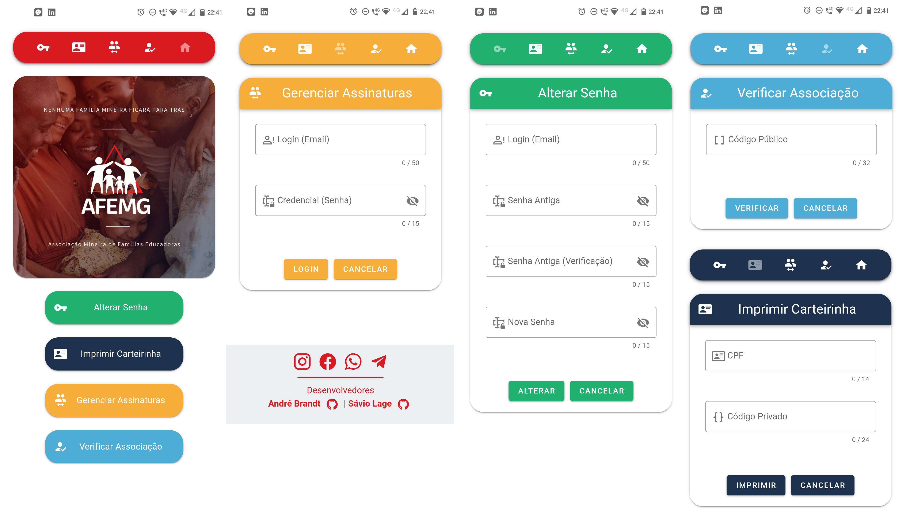
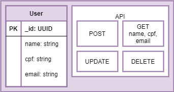
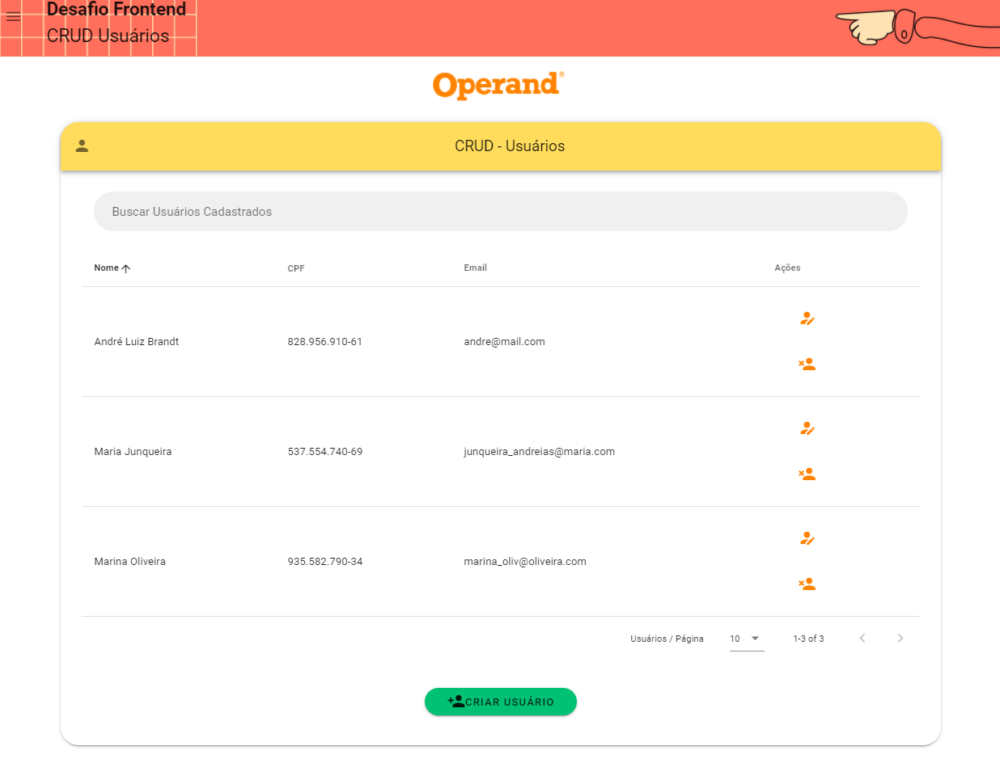

### Hi, I'm André Luiz! 👋

## 🔎 Who am I?

I'm a **Senior MuleSoft Developer and Software Engineer** from Brazil, with over five years of experience specializing in enterprise integrations, API development, and Salesforce-driven digital transformation.

I hold a bachelor's degree in **Computer Engineering from UNIFEI — Federal University of Itajubá** and have worked on complex integration projects across industries such as banking, healthcare, automotive finance, data privacy, retail, and oil and gas.

My experience includes designing, developing, testing, deploying, monitoring, and supporting scalable integration solutions using **MuleSoft Anypoint Platform**, API-led connectivity, REST and SOAP APIs, DataWeave, RAML, MUnit, Salesforce, and cloud-based development practices.

I also have experience leading development teams, supporting production environments, defining integration strategies, reviewing technical solutions, troubleshooting critical incidents, implementing CI/CD pipelines, and collaborating with international teams in fully English-speaking environments.

 

## 💡 Areas of Expertise and Interest

* MuleSoft and Enterprise Integration
* API Design and Development
* API-led Connectivity
* Integration Architecture
* REST and SOAP APIs
* DataWeave and RAML
* Salesforce Integrations
* Asynchronous and Event-driven Integrations
* Cloud and Hybrid Integration Solutions
* API Security and Governance
* CI/CD and DevOps Practices
* Automated Testing with MUnit
* Monitoring, Observability, and Production Support
* Microservices and Distributed Systems
* Technical Leadership and Solution Design

 

## 🛠️ Main Technologies

* **Integration:** MuleSoft, Anypoint Platform, CloudHub, API Manager, Anypoint MQ
* **API Development:** REST, SOAP, RAML, API-led Connectivity
* **Salesforce:** Sales Cloud, Service Cloud, Apex, LWC, Data Cloud, Agentforce
* **Languages:** DataWeave, Java, JavaScript, TypeScript, Node.js
* **Testing:** MUnit, Jest, integration and regression testing
* **DevOps:** GitHub Actions, Jenkins, Bamboo, Git, Docker, Kubernetes
* **Monitoring:** Anypoint Monitoring, Datadog, BetterStack
* **Databases:** PostgreSQL, MySQL, MongoDB
* **Collaboration:** Jira, Confluence, ServiceNow

 

## 🎯 Professional Focus

My goal is to build secure, resilient, maintainable, and scalable integration solutions that connect systems, simplify business processes, and reliably support critical enterprise operations.
 

## :wrench: Projects

### Salesforce - Mulesoft Custom User Object CRUD

  

This project contains a simple implementation of a REST API built on MuleSoft, which communicates with Salesforce. The API has the complete CRUD for a Custom Salesforce Object that represents users. Salesforce is a technology that provides customer relationship management (CRM) service and also provides a complementary suite of enterprise applications focused on customer service, marketing automation, analytics, and application development. MuleSoft is a technology that provides integration software for connecting applications, data and devices, designed to integrate software as a service (SaaS), on-premises software, legacy systems and other platforms. <a href="https://github.com/Luizbrandt/users-crud-salesforce">More info.</a>

#### Used Technologies
- <a href="https://www.salesforce.com/">Salesforce</a>
- <a href="https://www.mulesoft.com/">MuleSoft</a>

### Quotes Generator - 'bib' (Latex)

  

Latex quote's generator for '.bib' files and Overleaf projects. The user's inputs turn into a json-like variable that can be placed on a '/bib' file, or donwloaded as a '.bib' file. Click <a href="https://quote-generator-bib.web.app/">here</a> or in the logo above to go to the website. The following image shows the interface layout.

 

#### Used Technologies
- Vue.js (Vuetify)
- Node.Js (<a href="https://www.npmjs.com/package/file-saver">Node File Saver</a>)

### AFEMG Id Generator

  

ID generator for AFEMG (Associação Mineira de Famílias Educadoras). The administrator can regiester AFEMG's associates so they can use credentials to generate and print their ID. The ID contains two codes: public and private. The public one can be used on AFEMG's website to validate it's signature. The private one can be used with the user's CPF to generate a ID dynamically. Partner companies can use AFEMG's validation system to provide discounts and benefits to members and associates. Click <a href="https://afemg-clients.web.app/">here</a> or in the logo above to go to the website.

 

 

#### Used Technologies
- <a href="https://vuejs.org/">Vue</a>
- <a href="https://vuetifyjs.com/en/">Vuetify</a>
- <a href="https://nodejs.org/en/">Node</a>
- <a href="https://www.mongodb.com/">MongoDB</a>
- <a href="https://developer.mozilla.org/pt-BR/docs/Web/JavaScript">Javascript</a>

 

#### Collaborators
- <a href="https://github.com/Saviollage">Sávio Lage (Backend)</a>
 

### Users CRUD Api

Simple API that implements a User's CRUD using Node.Js and MongoDB. Created as a job application challenge - build an Vue.Js web.app that contemplate a User's CRUD (Create, Read, Update and Delete).
- <a href="https://users-simple-crud.herokuapp.com/">Heroku App</a>.
- <a href="https://github.com/Luizbrandt/user-crud-simple-api">GitHub Repository</a>.

#### Used Technologies
- MongoDB/Mongoose
- Express
- Node.Js
- Heroku App

### Users CRUD Frontend

User Interface (UI) built on Vue.js to consume the users crud simple API. The image below shows the main app's interface.

<strong>Information:</strong>
- <a href="https://operand-challenge.web.app/">WEB App</a>.
- <a href="https://github.com/Luizbrandt/vue-users-crud-frontend">GitHub Repository</a>.

#### Used Technologies
- Vue.Js (Vuetify, Router, Axios)
- Node.Js
- Firebase

## :trophy: Github Stats

  

 

## :phone: Wanna chat?
- <a href="https://linkedin.com/in/andré-luiz-brandt-engcomp">LinkedIn</a>.
- <a href="https://api.whatsapp.com/send?phone=+5524981642703">Whatsapp</a>.
- <a href="https://t.me/brandtluizandre">Telegram</a>.
- <a href="mailto:abrandtfrancisco@gmail.com">Mail me</a>.
