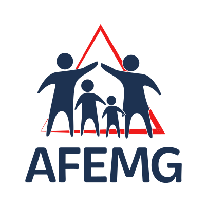

### Hi, I'm André Luiz! :)

## :mag: Who am I?

Hi! I'm a developer. Graduating on Computer Engineering on UNIFEI (Universidade Federal de Itajubá - Campus Itabira, MG, Brazil) - about to graduate at August 2021. Just a 24 year old guy trying to figure out things, always trying to code every single issue to turn it on solutions. Numbers, coffee, dogs and lines of code are my main passions.

 

## :bulb: Fields of Interest
- Software Engineering
- Frontend Development
- Machine Learning
- IOT
- Data Science
- DevOps
- Servless and Microservices architechture

 

## :chart_with_upwards_trend: Goals for 2021
- Become a pro on React and ReactNative
- Study more about Vue and Vuetify, Docker, Machine Learning and IOT
- Build fullstack projects using JavaScript (TypeScript + Node.Js), Vue, React and TypeORM
- Learn how to build Microservices and Serverless applications

 

## :green_book: Languages, Frameworks and Technologies

 

 
 

 ## :gem: Top Langs 
 
 
	

 

 

## :wrench: Projects

### AFEMG Id Generator

  

ID generator for AFEMG (Associação Mineira de Famílias Educadoras). The administrator can regiester AFEMG's associates so they can use credentials to generate and print their ID. The ID contains two codes: public and private. The public one can be used on AFEMG's website to validate it's signature. The private one can be used with the user's CPF to generate a ID dynamically. Partner companies can use AFEMG's validation system to provide discounts and benefits to members and associates. Click <a href="https://afemg-clients.web.app/">here</a> or in the logo above to go to the website.

 

 

#### Used Technologies
- <a href="https://vuejs.org/">Vue</a>
- <a href="https://vuetifyjs.com/en/">Vuetify</a>
- <a href="https://nodejs.org/en/">Node</a>
- <a href="https://www.mongodb.com/">MongoDB</a>
- <a href="https://developer.mozilla.org/pt-BR/docs/Web/JavaScript">Javascript</a>

 

#### Collaborators
- <a href="https://github.com/Saviollage">Sávio Lage (Backend)</a>
 

### Users CRUD Api

Simple API that implements a User's CRUD using Node.Js and MongoDB. Created as a job application challenge - build an Vue.Js web.app that contemplate a User's CRUD (Create, Read, Update and Delete).
- <a href="https://users-simple-crud.herokuapp.com/">Heroku App</a>.
- <a href="https://github.com/Luizbrandt/user-crud-simple-api">GitHub Repository</a>.

#### Used Technologies
- MongoDB/Mongoose
- Express
- Node.Js
- Heroku App

## :trophy: Github Stats

  

### Users CRUD Frontend

User Interface (UI) built on Vue.js to consume the users crud simple API.

- <a href="https://operand-challenge.web.app/">WEB App</a>.
- <a href="https://github.com/Luizbrandt/vue-users-crud-frontend">GitHub Repository</a>.

#### Used Technologies
- Vue.Js (Vuetify, Router, Axios)
- Node.Js
- Firebase

 

## :phone: Wanna chat?

 

<!-- Ideias de projeto: split almoço (coloca o preço, adiciona quem vai dividir, a pessoa ja recebe um pix por email pra pagar quem for o responsável por pagar); almoço ou rango conjunto simulator, pra ver se os convidados têm alergia a alguma comida (cadastra a pessoa, um dos atributos é uma lista de alergias ou intolerância, cria um evento almoço, janta, pique nique etc, coloca os convidados pessoas cadastradas, cadastra uma comida, um prato contendo uma lista de ingrediente, o app faz a verificação se alguém tem alergia a algum dos produtos ingredientes, e dá também sugestões de receitas que as pessoas não tenham alergia ou intolerância) -->
